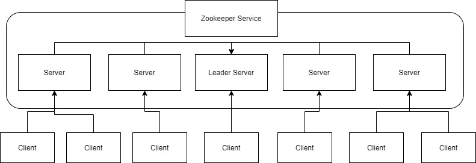

# ZooKeeper
참조
- https://d2.naver.com/helloworld/294797
- https://zaccoding.tistory.com/27

## 개요

데이터를 디렉터리 구조로 저장하고, 데이터가 변경되면 클라이언트에게 어떤 노드가 변경됐는지 콜백을 통해서 알려준다. 데이터를 저장할 때 해당 세션이 유효한 동안 데이터가 저장되는 Ephemeral Node라는 것이 존재하고, 데이터를 저장하는 순서에 따라 자동으로 일련번호가 붙는 Sequence Node라는 것도 존재한다. 조금 과장하면 이러한 기능이 ZooKeeper 기능의 전부다. 이런 심플한 기능을 가지고 자신의 입맛에 맞게 확장해서 사용하면 된다.

## 데이터 모델

ZooKeeper는 밑의 그림과 같은 디렉터리 구조로 데이터를 저장한다. 특징을 살펴보면 Persistent를 유지하기 위해서 트랜잭션 로그와 스냅샷 파일이 디스크에 저장되어 시스템을 재시작해도 데이터가 유지된다. 각각의 디렉터리 노드를 znode라고 명명하며, 한 번 설정한 이름은 변경할 수 없고 스페이스를 포함할 수도 없다.  

  
데이터를 저장하는 기본 단위인 노드 3가지가 있다
- Persistent Node
- Epthemeral Node
- Sequence Node

## Persistent Node

한 번 저장되고 나면 세션이 종료되어도 삭제되지 않고 유지되는 노드이다. 명시적으로 삭제하지 않는 한 해당 데이터는 삭제 및 변경되지 않는다.

## Ephemeral Node

특정 노드를 생성한 세션이 유효한 동안 그 노드의 데이터가 유효한 노드이다. ZooKeeper Server에 접속한 클라이언트가 특정 노드를 Ephermeral Node로 생성했다면 그 클라이언트와 서버 간의 세션이 끊어지면, 즉 클라이언트와 서버 간의 Ping을 제대로 처리하지 못한다면 해당 노드는 자동으로 삭제된다. 이 기능을 통해 클라이언트가 동작하는지 여부를 쉽게 판단할 수 있다.

## Sequence Node

노드 생성 시 sequence number가 자동으로 붙는 노드다. 이 기능을 확용해 분산 락 등을 구현가능하다.

## 서버 구성도  
  
Zookeeper 서버는 일반적으로 3대 이상 홀수로 구성된다. 서버 간의 데이터 불일치가 발생하면 데이터 보정이 필요한데 이때 과반수의 룰을 적용하기 때문에 서버를 홀수로 구성하는 것이 데이터 정합성 측면에서 유리하다. 그리고 ZooKeeper 서버는 Leader와 Follower로 구성되어 있다. 서버들끼리 자동으로 Leader를 선정하며 모든 데이터 저장을 주도한다.

클라이언트에서 Server(Follower)로 데이터 저장을 시도할 때 Server(Follower) → Server(Leader) → 나머지 Server(Follower)로 데이터를 전달하는 구조이고, 모든 서버에 동일한 데이터가 저장된 후 클라이언트에게 성공/실패 여부를 알려주는 동기 방식으로 작동한다. 즉 모든 서버는 동일한 데이터를 각각 가지고 있고, 클라이언트가 어떤 서버에 연결되어 데이터를 가져가더라도 동일한 데이터를 가져가게 된다.

주의사항으로 ZooKeeper를 캐시 용도로 사용해 서비스를 오픈했다가 장애가 발생한 사례가 종종있다. 데이터의 변경이 자주 발생하는 서비스에서 ZooKeeper를 데이터 저장소로 사용하는 것은 추천하지 않는다. ZooKeeper에서 추진하는 Read : Write 비율은 10 : 1 이상이다.

ZooKeeper 서버가 제대로 실행되지 않을 때가 있는데, 대부분 서버간의 데이터 불일치로 인한 데이터 동기화 실패가 원인이다. 주로 베티 테스트 후 운영 직전에 Zookeeper 서버를 증설해서 사용하는데, 이럴 때 기존에 테스트했던 서버와 신규로 투입한 서버의 데이터 차이로 인해 이런 현상이 발생한다. 이 때는 데이터를 초기화한 후 서버를 실행한다.

zoo.cfg라는 설정(configuration) 파일의 ZooKeeper 서버 목록을 꼼꼼히 확인해야한다. 서버 목록이 정확히 맞지 않아도 서버가 실행되긴 하지만, 로그 파일을 확인하면 ZooKeeper 서버가 지속적으로 재시작할 때도 있고 데이터를 엉뚱한 곳에 저장하기도 한다.

## 분산 락 처리

하나의 어플리케이션에서는 같은 JVM 위에서 동작하기 때문에 java.util.concurrent 패키지의 Lock이나 Semaphore등으로 하나의 스레드만 동작하게 할 수 있습니다. 하지만 이중화와 같이 다른 물리 서버에서 동작 할 경우 위의 인스턴스를 이용하여 하나의 스레드만이 task를 수행하도록 할 수 없기에 ZooKeeper를 사용하여 아래와 같이 분산 락 처리가 가능하다.

### CuratorFramework 생성

```java
@RequiredArgsConstructor
@Configuration
public class ZookeeperConfiguration {

    private final ZookeeperProperties properties;

    @Bean(destroyMethod = "close")
    public CuratorFramework curatorFramework() {
        RetryPolicy retryPolicy = new RetryNTimes(
                properties.getMaxRetries(),
                properties.getSleepMsBetweenRetries());

        final CuratorFramework client =
                CuratorFrameworkFactory.newClient(properties.getConnectString(), retryPolicy);

        client.start();
        return client;
    }
}
```

### Lock acquire & lease

```
@Slf4j
@RequiredArgsConstructor
@RestController
@RequestMapping("/locking")
public class LockingExampleController {

    // required
  private final CuratorFramework curatorFramework;
  private final Map<String, InterProcessSemaphoreMutex> mutexMap = new HashMap<>();

  private boolean acquireLock(String taskId, long timeout, TimeUnit timeUnit) {
      final String path = "/lock/mutex/" + taskId;
      final InterProcessSemaphoreMutex mutex = new InterProcessSemaphoreMutex(curatorFramework, path);

      try {
          if (mutex.acquire(timeout, timeUnit)) {
              mutexMap.put(taskId, mutex);
              return true;
          }
      } catch (Exception e) {
          logger.warn("Exception occur while acquiring {} lock.", taskId, e);
      }

      return false;
  }

  private void releaseLock(String taskId) {
    InterProcessSemaphoreMutex mutex = mutexMap.remove(taskId);

    if (mutex == null || !mutex.isAcquiredInThisProcess()) {
        logger.warn("{} didn't acquired lock.", taskId);
        return;
    }

    try {
        mutex.release();
    } catch (Exception e) {
        logger.warn("Exception occur while releasing a {} lock", taskId, e);
    }
  }

```

InterProcessSemaphoreMutex를 유지하는 이유는 락을 획득 한 이후 내부에서 org.apache.curator.framework.recipes.locks.Lease 인스턴스를 유지하기 때문이다. 실제로 “/lock/mutex/aaa” path로 lock을 요청 한 뒤 ZooKeeper를 조회하면 아래와 같은 Path에 임시 노드(Ephemeral)로 생성을 요청한다.
- /lock/mutex/aaa
- /lock/mutex/aaa/locks
- /lock/mutex/aaa/leases
- /lock/mutex/aaa/leases/c9575b095-e158-4b38-af76-0e689daa9a58-lease-0000000000
