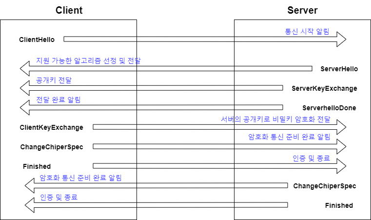

# TLS
## Reference
> - https://b.luavis.kr/server/tls-101
> - https://m.blog.naver.com/xcripts/70122755291
## Difinition
> 인터넷 상에서 암호화된 데이터를 송수신하는 프로토콜  
> TLS는 크게 2단계로 구분된다. protocol 버전과 암호화할 키를 주고 받는 **handshake**와 실제 **application이 동작하는 단계**다.  
>> handshake 단계에서는 모든 내용이 평문으로 주고 받게 된다.( TLS 1.3 부터는 handshake 중에도 암호화가 된다)  
>> application의 내용이 주고 받아지는 부분에서는 대칭키 암호화가 이루어진다.  
## HMAC
> 메시지의 손상 여부를 파악하기 위해 사용되는 기술은 MAC(Message Authenrication Code)이다  
> 그 중에 TLS는 HMAC(Hash MAC)을 사용한다.  
>> 'A'라는 메시지를 보낸다고 하였을 때, 송신 peer는 A를 수신 peer와 함의한 Hash함수를 이용하여 hash값을 만들고 메시지 'A'에 hash를 덧붙힌 A를 보낸다. 이를 수신한 peer는 A와 Hash를 분리하고 A의 hash 값을 구한 뒤 받은 값과 비교하여 검증한다.  
## Digital signature
> 신뢰 받는 기관 ( 이 글에서는 Root CA로 호칭하겠다 )에서 내 문서가 사실임을 검증받고 다른 peer들도 이 사실이 사실임을 확인하게 하는 체계다.  
> 일반적으로 Digital signature는 RSA 알고리즘을 이용한다. Root CA에서 요청자 문서의 hash값을 구하고 RSA private key로 암호화한다. 그리고 암호화한 값(signature)을 해당 문서 뒤에 첨부한다. 이 문서를 받은 peer는 서명한 Root CA public key로 복호화한 signature와 비교한다. 일치한다면 Root CA에서 signature된 문서라고 판단한다.  

## Chain of trust

   

## PKCS
> Public Key Cryptography Standard는 RSA Security Inc.에서 발행하는 공개키 암호화 표준이다.  
> RSA에 보안성을 더 강화하기 위해 데이터를 복잡하게 만들거나, 암호화 하는 데이터의 크기를 늘려 암호화하는 방식을 정의한 것이다.   

## X.509
> SSL 인증서를 발급 받을때 ```.der``` 혹은 ```.pem```으로 되어 있는 인증서 파일을 받는데 이런 인증서 표준을 X.509라 한다.  
> domain, CA 이름, 유효기간, 사이트의 RSA공개키가 들어간다. 그리고 마지막에는 CA에서 서명한 디지털 서명이 포함왼다.  
> X.509 인증서 구조로는 아래와 같다.  
- Certificate
  - Version ```인증서 버전```  
  - Serial Number ```CA가 할당한 정수로 된 고유 번호```  
  - Signature ```서명 알고리즘 식별자```  
  - Issuer ```발행자 ( CA 이름 )```  
  - Validity ```유효기간```  
    - Not Before ```유효기간 시작 날짜```  
    - Not After ```유효기간 만료 날짜```  
  - Subject ```소유자 ( 주로 사이트의 소유자의 도메인 혹은 하위 CA의 이름 )```  
  - Subject Public Key Info ```소유자 공개키 정보```  
    - Public key Algorithm ```공개 키 알고리즘의 종류```  
    - Subject Public Key ```공개 키```  
  - Extentions ```확장 필드```  
    - ....  
- Certificate Signature Algorithm ```디지털 서명의 알고리즘 종류 ( sha256WithRSA, sha1WithRSA,...)```  
- Certificate Signature ```디지털 서명 값```  
> 위의 인증서 구조를 보면 ```Subject```가 하나만 있다. ```Subject```에는 도메인이 명시되는데, X.509 구조에서는 하나의 인증서는 하나의 도메인만 인증이 가능하다.  
> 만약 Web site 관리자가 두 개의 도메인(example.com, www.example.com)을 갖지만 같은 서비스를 운영한다면, 인증서를 두개 발급받아야한다. 이를 보완하고자, X.509 v3 인증서 표준에서는 확장 기능으로 SAN(Subject Alternative Name)이라는 기능을 제공한다. 여기에 ```Subject```의 이름 외에도 다른 도메인들을 명시해서 하나의 인증서지만 복수의 도메인을 인증받을 수 있다.  
 
## Cipher Suite
> TLS에서는 암호화하는 방법을 표준으로 특정하지 않고, server와 client가 합의하여 결정.  
> 서로 합의해야 하는 알고리즘은 **대칭키 전달, 인증서 서명 방식, 대칭키 알고리즘, HMAC 알고리즘**이다.  
>> - 대칭키 전달 ```ECDHE(Elliptic Curve Diffie Hellman Ephermeral)```  
>> - 인증서 서명 방식 ```RSA로 서명된 인증서로 상호간 신원 확인```  
>> - 대칭키 알고리즘 ```AES 256bit와 GCM을 채택```  
>> - HMAC 알고리즘 ```SHA 384를 사용하여 메시지 무결성 확인```  
> 서버와 클라이언트가 이 4가지 알고리즘을 세트로 합의하고, 합의된 알고리즘으로 application layer의 내용을 암호화해서 전송.  

## TLS 동작
> application protocol의 내용을 암호화하는데에 목적을 둔다.  
> 암호화 전에, TLS Handshake protocol은 TLS 버전과 cipher suite를 합의하고, 인증서를 교환한다.  
> 필요하다면 Diffie-Hellman 키도 공유한다.  
> - Diffie-Hellman ```암호 키를 교환하는 방법으로, 두 사람이 암호화 되지 않은 통신망을 통해 공통의 비밀키를 공유할 수 있도록 한다.```  
> 동작 순서로 아래의 예제를 살펴보자.  
 
 

> 1. client가 server에 접속하면 서버 인증서```서버의 공개키를 인증기관이 전자서명으로 인증```를 전송받습니다.  
> 2. client는 받은 server 인증서를 분석하여 신뢰할 수 있는 인증서인지 검토한 후, 서버의 공개 키를 추출한다.  
> 3. client가 세션키로 사용할 임의의 메세지를 서버의 공개키로 암호화하여 서버에 전송한다.  
> 4. server에서는 자신의 개인키로 세션키를 복호화하여 그 키를 사용하여 대칭키 암호방식으로 메시지를 암호화하여 클라이언트와 통신하게 된다.
