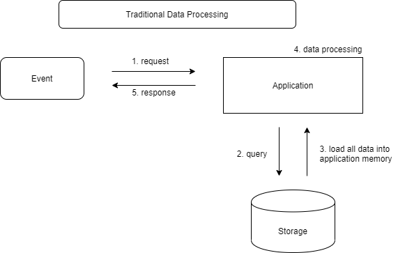
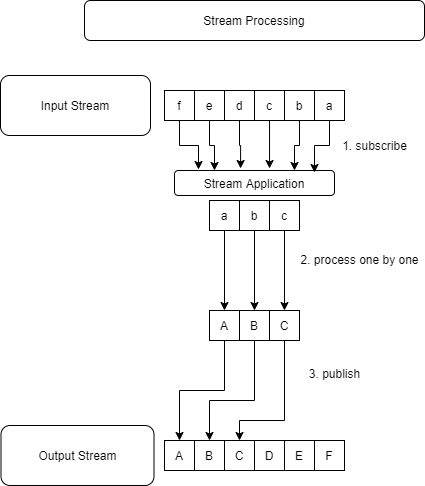
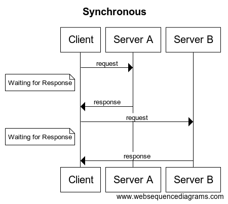
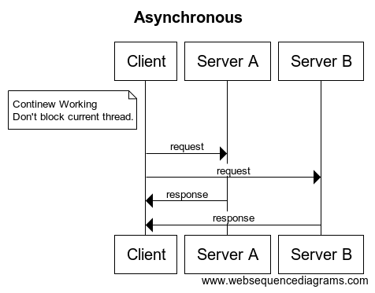
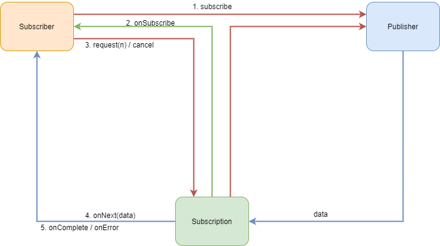

#Armeria
reference
- https://engineering.linecorp.com/ko/blog/reactive-streams-with-armeria-1/
## Reactive Stream
`Reactive Streams`는 비동기식 데이터 처리를 위한 표준으로 non-blocking 역압으로 스트리밍 방식으로 처리

## 스트리밍 처리
### 전통적인 데이터 처리 방식

데이터 처리 요청이 오면 payload 를 모두 Application의 메모리에 저장 한 후에 다음 처리를 해야한다. 추가로 필요한 데이터도 저장소에서 조회하여 메모리에 적재해야 한다.  

이 방식의 문제점은 전달된 데이터는 물론 저장소에서 조회한 데이터까지 모든 데이터가 애플리케이션의 메모리에 적재되어야만 응답 메시지를 만들 수 있다.

만약 필요한 데이터의 크기가 메모리 용량보다 크다면 'out of memory' 에러가 발생하게 된다. 그리고 서비스를 운영하다보면 꼭 하나의 요청이 'out of memory'를 발생시키지 않더라도, 순간적으로 많은 요청이 몰리면서 다량의 GC가 발생, 서버가 정상적으로 응답하지 못하는 경우가 종종 나타난다.

### 스트림 처리 방식


많은 양의 데이터를 처리하는 Application에 Stream Processing을 적용하면 크기가 작은 시스템 메모리로도 많은 양의 데이터를 처리할 수 있다. 입력 데이터에 대한 파이프 라인을 만들어 데이터가 들어오는 대로 물 흐르듯이 구독(`subscribe`)하고, 처리한 뒤, 발생(`publish`)까지 한 번에 연결하여 처리할 수 있다.

이렇게 하면 서버는 많은 양의 데이터도 탄력적으로 처리할 수 있다. 

### 비동기 방식
아래 그림은 비동기 프로세스와 동기 프로세스를 비교한 그림이다.




동기 방식에서는 클라이언트가 서버에 요청을 보내면 응답을 받기 전짜리 blocking 된다. 따라서 요청을 2개 보내면 A의 응답이 끝나고 B를 요청할 수 있다.

하지만 비동기 방식에서는 하나의 Thread가 blocking되지 않기 때문에 A에게 요청을 보낸 뒤 B에게 요청을 바로 보낼 수 있다.

- 빠른 속도 : 두 개의 요청을 동시에 보내기 때문에 더 빠른 응답 속도를 보여줄 수 있다.
- 적은 리소스 사용 : 하나의 Thread가 blocking되지 않고 다른 업무를 처리 할 수 있어서 더 적은 수의 Thread로 더 많은 양의 요청을 처리할 수 있다.

 ## 백 프레셔
 백 프레셔에 대해 알아보기 전에 RxJava로 유명해진 `옵저버 패턴`과 `푸시 방식`, 그리고 `풀 방식`에 대해서 알아보자.
 
 ### 푸시 방식
Observer 패턴에서는 발행자(publisher)가 구독자(subscriber)에게 밀어 넣는 방식으로 데이터가 전달된다. 
발행자는 구독자의 상태를 고려하지 않고 데이터를 전달하는 데이만 충실합니다. 만약 발행자가 1초 동안 100개의 메시지를 보내는데 구독자는 1초에 10개밖에 처리하지 못한다면 어떻게 해야 할까?  
큐(Queue)를 이용해서 대기 중인 이벤트를 저장한다.

서버가 가용할 수 있는 메모리는 한정되어 있다. 만약 초당 100개의 메모리를 계속 푸시한다면 버퍼는 순식간에 소모될 것이다. 버퍼를 다 사용해서 오버플로(overflow)가 발생하면 어떻게 될까?  
고정 길이 버퍼와 가변 길이 버퍼로 나누어 살펴보자.

#### 고정 길이 버퍼 
1. 신규로 수신된 메시지를 거절한다.
2. 거절된 메시지는 재요청하게 된다.
3. 재요청 과정에서 네트워크와 CPU 연산 비용이 추가로 발생한다. 

#### 가변 길이 버퍼
1. 이벤트를 저장할 때 'out of memory' 에러가 발생하면서 서버 크래스(crash)가 발생한다.

### 풀 방식
위와 같은 문제 해결 방법으로 발행자(publisher)가 데이터를 전달할 때 구독자(subscriber)가 필요한 만큼만 전달하면 된다.  
이 원리가 백 프레셔의 기본 원리이다.

풀 방식에선 구독자가 10개를 처리할 수 있다면 발행자가에게 10개만 요청한다. 발행자는 요청받은 만큼만 전달하면 되고, 구독자는 더 이상 'out of memory' 에러를 걱정하지 않아도 된다.

좀 더 탄력적으로 적용하여, 구독자가 이미 8개 일을 처리하고 있다면 추가로 2개만 더 요청하여 자신이 현재 처리 가능한 범위 내에서만 메시지를 받게 할 수 있다.
풀 방식에선 이렇게 전달되는 모든 데이터의 크기를 구독자가 결정한다. 이런 다이나믹 풀 방식의 데이터 요청을 통해서 구독자가 수용할 수 있는 만큼만 데이터를 요청하는 방식이 백 프레셔이다.

## 표준
Reactive Streams는 표준화된 API이다. 

Reactive Streams는 Netflix와 pivotal, Lighbend의 엔지니어들이 처음 개발하기 시작했다. Netflix는 RxJava, Pivotal은 WebFlux, 그리고 Lightbend는 분산 처리 액처 모델을 구현한 Akka를 만든 회사이다.
모두 스트럼 API가 필요한 회사였다. 그런데 스트림은 서로 유기적으로 엮여서 흘러야 의미가 있다. 데이터가 지속적으로 흐르기 위해서는 서로 다른 회사가 공통의 스펙을 설정하고 구현해야 한다. 그래서 표준화가 필요하다.

Reactive Streams에선 JVM에서 사용하기 위한 1.0.0 스팩을 2015년 4월에 release했다. 그리고 2017년 9월에 Reactive Streams의 API와 스펙, 풀 방식 사용 원칙을 그대로 포팅해서 Flow APIㄹ는 이름으로 concurrent 패키지 아래 포함시킨 Java 9가 릴리스되었다.
이는 커뮤니티와 일부 기업에서 주도해 개발했던 Reactive Streams가 Java의 공식 기능이 되었다는 것을 의미한다. 이어서 3달 뒤, Reactive Streams에서 Flow와 상호 변환이 가능한 어댑터를 릴리스하면서, 기존에 만들어진 라이브러리를 사용할 수 있게 되었다.

## Reactive Streams API
Reactive Streams 내부는 아주 간단한 API들의 조합으로 구성되어 있다.
```java
public interface Publisher<T> {
    public void subscribe(Subscriber<? super T> s);
}

public interface Subscriber<T> {
    public void onSubscribe(Subscription s);
    public void onNext(T t);
    public void onError(Throwable t);
    public void onComplete(); 
 }

public interface Subscription {
    public void request(long n);
    public void cancel();
}
```
- `publisher`에는 `Subscriber`의 구독을 받기 위한 `subscribe` API 하나만 있습니다.
- `Subscriber`에는 받은 데이터를 처리하기 위한 `onNext`, 에러를 처리하는 `onError`, 작업 완료 시 사용하는 `onComplete`, 그리고 매개 변수로 `Subscription`을 받는 `onSubscribe` API가 있다.
- `Subscription`은 n개의 데이터를 요청하기 위한 `request`와 구독을 취소하기 위한 `cancel` API가 있다.

이제 Reactive Streams에서 위 API를 사용하는 흐름을 살펴보자.




1. `Subscriber`가 `subscribe` 함수를 사용해 `Publisher`에게 구독을 요청한다.
2. `Publisher`는 `onSubscribe` 함수를 사용해 `Subscriber`에게 `Subscription`을 전달한다.
3. 이제 `Subscription`은 `Subscriber`와 `Publisher` 간 통신의 매개체가 된다. `Subscriber`는 `Publisher`에게 직접 데이터 요청을 하지 않는다.
4. `publisher`는 `Subscription`을 통해 `Subscriber`의 `onNext`에 데이터를 전달하고, 작업이 완료되면 `onComplete`, 에러가 발생하면 `onError` 시그널을 전달한다.
5. `Subscriber`와 `Publisher`, `Subscription`이 서로 유기적으로 연결되어 통신을 주고 받으면서 `subscribe`부터 `onComplete`까지 연결되고, 이를 통해 백 프레셔가 완성된다.

## Reactive Stream 구현체와 상호운영성(interoperability)
Reactive Streams에는 다양한 구현체가 존재한다. 각각의 구현체는 서로 특성이 조금씩 다르기 때문에 상황에 따라, 필요에 맞게 골라서 사용할 수 있다.

- 순수하게 스트림 연산 처리만 필요하다면 `RxJava`나 `Reactor Core`, `Akka Streams` 등을 사용하면 된다.
- 저장소의 데이터를 Reactive Streams로 조회하고 싶다면 `ReactiveMongo`나 `Slick` 등을 사용하면 된다.
- 웹 프로그래밍과 연결된 Reactive Streams가 필요하다면 `Armeria`와 `Vert.x`, `Play Framework`, `Spring WebFlux`를 활용할 수 있다.

## Armeria
### 개요
Armeria는 java 8 및 Netty, Thrift, gRPC에 기반한 오픈 소스 비동기 HTTP/2, RPC, REST 클라이언트/서버 라이브러리이다. Armeria는 경량 마이크로 서비스 프레임워크지만 지원하는 기능은 다른 풀 스택 웹 프레임워크와 비교해도 손색이 없다.

### 지원하는 Protocol
Armeria에서는 HTTP/1과 HTTP/2를 모두 지원하고, 이 두개의 프로토콜은 cleartext와 TLS 암호화 통신을 모두 지원한다. HTTP/1에서 HTTP/2로의 호환성을 지원하기 위한 프로토콜 업그레이드 면에선, HTTP/2의 'connection preface'와 HTTP/1의 'upgrade request'를 모두 지원하고 있다.

또한 Armeria에선 gRPC와 Thrift가 HTTP/1과 HTTP/2, 양쪽에서 모두 동작한다. 이는 Armeria만의 특별한 기능이다. gRPC는 HTTP/1을 지원하지 않고, 기존의 Thrift에선 HTTP/2를 지원하지 않는다. 하지만 Armeria에서는 모두 지원하고 있어서 다양한 비즈니스 환경에서 유연하게 사용할 수 있다. 또한 리눅스 환경에선 JNI(Java Native Interface) 기반의 소켓 IO와 BoringSSl 기반의 TLS를 통해서 더욱 빠른 성능으로 프로덕션에 사용할 수 있다.

### 예제
