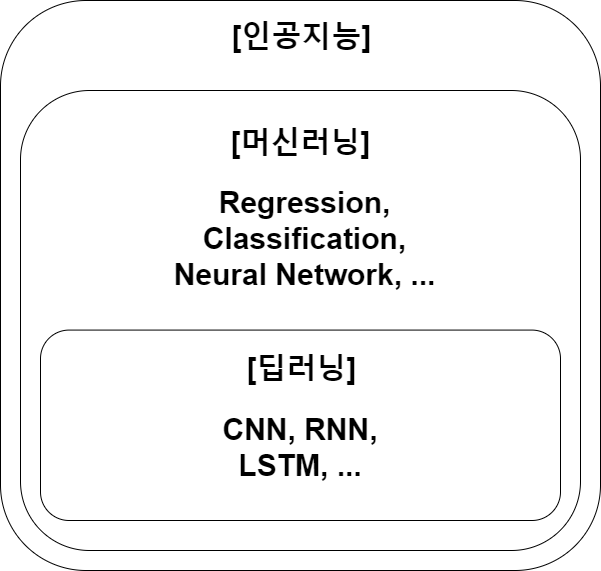

# Machine Learning
## 인공지능 && 머신러닝 && 딥러닝

### 인공지능
인간의 학습능력, 추론능력 등을 컴퓨터를 통해 구현하는 포괄적인 개념

### 머신러닝
데이터를 이용하여 명시적으로 정의되지 않은 **패턴을 학습**하여 미래 결과(값, 분포)를 예측  
데이터마이닝 : 데이터간의 상관관계나 속성을 찾는 것이 주목적

### 딥러닝 
머신러닝의 한 분야로서 신경망(Neural Network)을 통해 학습하는 알고리즘의 집합

## 딥러닝 - Neural Network
이전 뉴런 출력을 각각의 입력으로 받아 + or -  가중치를 통해 전체의 합을 합하여 특정 임계치(threshold)를 넘으면 다음 뉴런으로 전달하는 원리