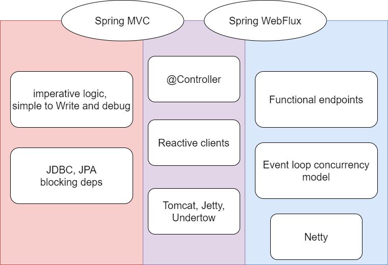
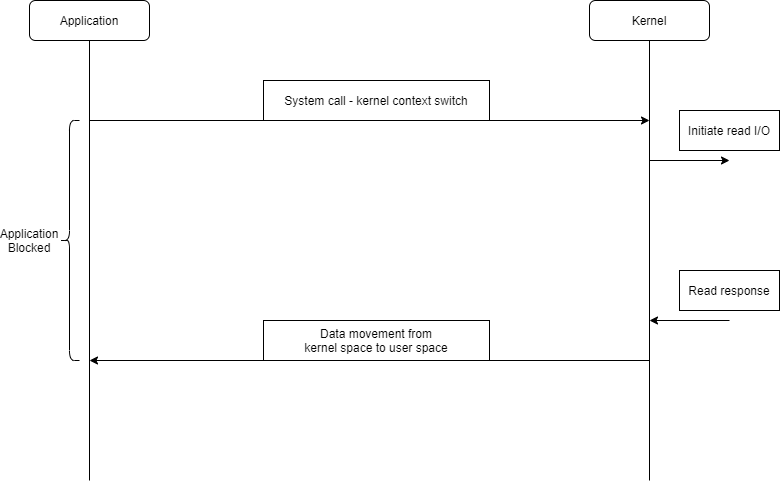
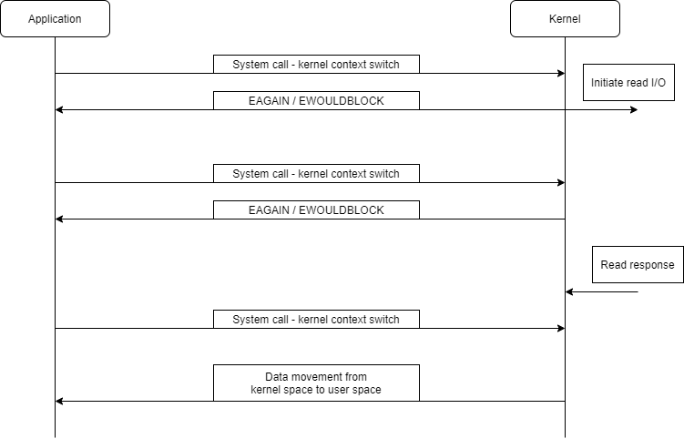
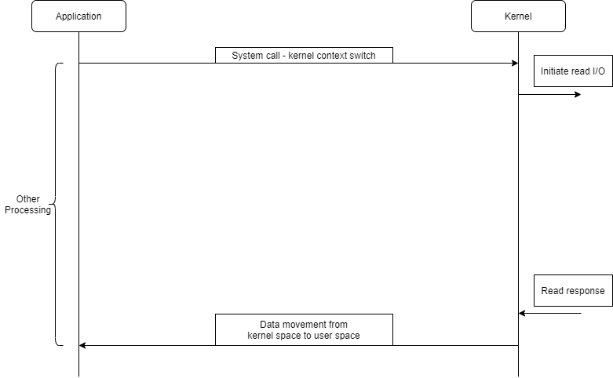

# WebFlux
reference
- https://d2.naver.com/helloworld/6080222
- https://alwayspr.tistory.com/44

## Monolithic 아키텍처
### 개요 
오랫동안 많은 개발자들이 좋아하며 사용한 아키텍처로 하나의 커다란 서비스와 저장소로 구성 된 아키텍처이다.
### 문제점
1. 하나의 모듈이 변경되어도 전체 서버를 배포해야 했고 작은 기능의 문제점도 곧 서버 전체의 문제점이 된다.
2. 많은 코드가 엮여 있기 때문에 변화하는 비지니스의 요구 사항에 유연하게 대처하지 못한다.
 
## MSA ( Microservice Architecture )
### 개요
- Monolithic Architecture의 대안으로 나온 아키텍처
- Netflix에서 적용
- 커다란 서비스는 작은 단위의 독립된 모듈로 쪼개지고 추가 기능이나 확장이 필요하면 해당 모듈만 변경하면 됨.
- Monolithic 아키텍쳐에서 MSA로 넘어오는 추세

### 문제점
단일 Application 내부의 메서드 콜을 통한 정보 교환이 네트워크를 타고 모듈 간의 정보교환으로 바뀌었기 때문이다. 스레드 풀을 이용한 동기식 호출 방식은 코드가 간단하고 순차적으로 동작하기 때문에 개발자가 코드를 직관적이고 빠르게 작성할 수 있다.   
하지만 동기식 호출 발식에서는 상대편의 응답이 올 때까지 스레드는 Blocking 되야한다. 응답이 빨리 오면 그 기다림은 길지 않겠지만 만약 `응답이 늦게 오면 서버가 요청에 대한 응답을 기다리는 데 Thread를 모두 소진해서 추가 요청을 처리할 수 없는 상태`가 된다.  
요청을 한 클라이언트와 요청을 처리하는 서버 둘만의 문제가 아니다. MSA에서는 타임아웃이 발생할 정도의 지연이 발생하면 다른 모듈로 전파되어 전체 시스템이 마비되는 등의 악영향을 끼칠 수 있다.

### 방안
Thread가 서버로 요청을 하고 나서 `응답을 기다리며 대기할 필요 없이 다른 일을 처리하다가 응답이 왔을 때 해당 일을 처리`하는 것이다.  
해당 방법은 `이벤트 루프를 이용한 비동기 프로그래밍`이다.  
  
이벤트 루프를 활용하면 요청을 보내고 응답이 올 때까지 무작정 기다리는 대신 자신에게 할당된 다른 여러 소켓의 요청을 순차적으로 빠르게 처리한다. Spring 생태계에서도 Version 5부터 도입된 WebFlux를 통해 비동기 프로그래밍을 본격적으로 도입하고 있다.  

## Spring WebFlux
### 기존의 Spring Framework(Spring MVC)
Spring MVC의 기본형태
1. XML 기반의 환경설정과 DispatcherServlet 기반의 코드를 WAR로 패키징한다.
2. 이를 Tomcat 등 WAS의 docRoot에 배포한다.
3. WAS를 별도로 기동시켜야 Application이 동작한다.  

이런 구조는 단일 Application 구조에서는 나쁘지 않은 방법이었으나 밑에와 같은 단점이 있다.
- 관리의 이원화
  - Application의 설정과 WAS의 설정을 별도로 관리해야 한다.
- 배포 및 설정의 불편
  - WAS 중지 -> WAR 패키지 배포 -> WAS 기동 등의 단계가 필요
  - XML 기반의 설정은 Application을 기동해보기 전까지 설정이 맞는지 틀렸는지 알 수 없다.
- WAS 의존적인 구조
  - Servlet 기반이기 때문에 WAS를 벗어나 단독으로 기동할 수 없다.

이 문제점은 MSA의 치명적인 단점으로 자주 언급된다. 이러한 어려움은 많은 개선을 거쳐왔다.
- Version 3 에서는 JavaConfig, Annotaion 기반 설정이 도입되어 XML 기반 설정의 불편함이 대폭 개선
- Version 4 에서는 Spring Boot의 AutoConfig에 힘입어 설정의 대폭 간소화 및 WAS 엔진의 내장으로 단일 JAR 파일로 패키징하여 배포하는 것이 가능

하지만 이러한 개선에도 Async Non-Blocking에 대한 미비한 지원이 발목을 잡고 있었다. JDK에도 java.nio나 람다 표현식과 같은 Modern-Language의 장점이 추가되고 Servlet 3.1 스펙에도 Async Servlet이 추가되는 등의 움직임이 있었지만 아직도 많은 Application들이 기존 방식대로 쓰이고 있다.

### Spring WebFlux 개발 배경
Servlet 3.1 스펙에서는 Non-Blocking I/O를 지원하지만 기존 Servlet API에 동기식(Filter, Servlet), Blocking(getParameter, getPart) 등 레거시가 많이 남아있었다.  
Spring WebFlux는 Spring MVC와 달리 Servlet과는 전혀 관계없이 만들어졌으며, 그렇기 때문에 더이상 WAS가 필요하지 않다. 기본 설정은 Netty(reactor-netty)를 기반으로 하지만 별도 설정을 통해 다른 Servlet 3.1 스펙을 준수하는 WAS 엔진(Tomcat, Jetty 등)도 사용할 수는 있다. 하지만 특정 WAS에 대한 의존성이 있는 코드 등의 특수한 경우를 제외하면 Netty로 사용하는 것을 권장한다. 또한 Project Reactor를 통해서 Reactive Programming을 지원한다.

- Project Reactor?
  - Reactive Streams의 구현체이다. Reactive Streams는 단순히 JVM 기반에서 Async Non-Blocking 처리를 위한 스펙을 명세한 것이며 다른 구현체로는 RxJava, Akka Streams 등이 있다. 뒤에서 다룰 Armerica에서도 해당 스펙을 직접 구현했다. 같은 스펙 명세를 구현했으므로 구현체끼리는 모양새와 사용법이 거의 유사하다. Reactive Streams 및 Backpressure 관련 내용이 궁금하다면 LINE Engineering 블로그 `Armeria로 Reactive Streams와 놀자! - 1` 포스팅을 참고하자.
  
  
 
 WebFlux와 MVC는 생각보다 많은 부분에서 상호 호환이 이루어진다. MessageConverter나 Exception 처리 같은 많은 부분에서 별도의 코드 수정 없이 바로 예전 코드를 가져다 쓸 수 있다.

## I/O 처리 방식
### Blocking I/O

가장 기본적인 I/O 모델로 Spring MVC와 RDBMS를 사용하고 있으면 대부분 이 모델을 사용하고 있다.  

Application에서 I/O 요청을 한 후 완료되기 전까지는 Application이 Block이 되어 다른 작업을 수행할 수 없다. 이는 해당 자원이 효율적으로 사용되지 못하고 있음을 의미한다.

Application들은 Blocking 방식임에도 불구하고 Block이 안된듯이 동작하는 것은 Multi Thread를 기반으로 동작하기 때문이다.

### Synchronous Non-Blocking I/O
 
Application에서 I/O를 요청 후 바로 return되어 다른 작업을 수행하다가 특정 시간에 데이터가 준비가 다 되었는지 상태를 확인한다. 데이터의 준비가 끝날 때까지 틈틈이 확인을 하다가 완료가 되었으면 종료한다.

주기적으로 체크하는 방식을 폴링(Polling) 이라고 한다. 그러나 이러한 방식은 작업이 완료되기 전까지 주기적으로 호출하기 때문에 불필요하게 자원을 사용한다.

### Asynchronous Non-blocking I/O

I/O 요청을 한 후 Non-Blocking I/O와 마찬가지로 즉시 리턴된다. 하지만 데이터 준비가 완료되면 이벤트가 발생하여 알려주거나, 미리 등록해놓은 callback을 통해서 이후 작업이 진행된다.

이전 두 I/O의 문제였던 Blocking이나 Polling이 없기 때문에 자원을 보다 더 효율적으로 사용한다.
 
 ## 구현
 ### WebFlux
 `DemoRouter.java`
 ```java
@Configuration
public class DemoRouter {
    @Bean
    public RouterFunction<ServerResponse> routes(DemoHandler demoHandler) {
        return RouterFunctions.route(RequestPredicates.POST("/demo"), demoHandler::post);
    }
}
```
`DemoHandler.java`
```java
@Slf4j
@Component
@RequiredArgsConstructor
public class DemoHandler {

    private final Validator validator;
    private final DemoService demoService;

    public Mono<ServerResponse> post(ServerRequest serverRequest) {
        Flux<DemoResponse> ret = demoService.post(
            serverRequest.bodyToFlux(DemoModel.class).filter(demoModel -> {
                Set<ConstraintViolation<DemoModel>> validationResult = validator.validate(demoModel);

                if(validationResult.isEmpty()) {
                    System.out.println("validation result :: true");
                    System.out.println("validation retuls :: " + validationResult);
                    System.out.println("demo model :: " + demoModel.toString());
                    return true;
                } else {
                    System.out.println("validation result :: false");
                    return false;
                }
            })
        );
        return ServerResponse.ok().body(ret, DemoResponse.class);
    }
}
```
`DemoService.java`
```java
@Slf4j
@Service
public class DemoService {

    public Flux<DemoResponse> post(Flux<DemoModel> demoModelFlux) {
        return demoModelFlux.flatMap(demoModel -> {
            System.out.println("demoModel :: " + demoModel);
            return Flux.just(new DemoResponse(demoModel, true));
        });
    }
}

```
`DemoModel.java`
```java
@Getter
@Setter
@ToString
@Validated
@Builder
@NoArgsConstructor
@AllArgsConstructor
public class DemoModel {

    @NotEmpty
    private String id;
    private Map<String, String> data;
    private LocalDateTime createDateTime = LocalDateTime.now();
    private String source;
    private double version = 1.0;
}
```
`DemoResponse.java`
```java
@Getter
@Setter
@ToString
@NoArgsConstructor
@AllArgsConstructor
public class DemoResponse {

    private DemoModel content;
    private boolean result;
}
```
`WebfluxApplicationTest.java`
```java
@SpringBootTest(webEnvironment = SpringBootTest.WebEnvironment.RANDOM_PORT)
class WebfluxApplicationTests {

    @Autowired(required = false)
    private WebTestClient webClient;

    @Test
    void contextLoads() {
        DemoResponse response = new DemoResponse();
        DemoModel model = new DemoModel();
        model.setId("1");
        response.setContent(model);
        response.setResult(true);

        ArrayList responseBody = this.webClient.post().uri("/demo").contentType(MediaType.APPLICATION_JSON)
                .accept(MediaType.APPLICATION_JSON)
                .body(Mono.just(model), DemoModel.class).exchange()
                .expectStatus().isOk()
                .expectBody(ArrayList.class)
                .returnResult().getResponseBody();

        DemoResponse demoResponse = modelMapper.map(responseBody.get(0), DemoResponse.class);
    }
}
```
---
### blocking vs non-blocking
#### blocking I/O
```
@Test
@DisplayName("test blocking I/O")
public void blockingTest() {
    stopWatch.start();

    for (int i = 0; i < LOOP_COUNT; i++) {
        final ResponseEntity<String> response = restTemplate.exchange(THREE_SECONDS_URL + "/three/block", HttpMethod.GET, HttpEntity.EMPTY, String.class);
    }
    stopWatch.stop();

    System.out.println("blocking Test total times :: " + stopWatch.getTotalTimeSeconds());
    assertTrue(stopWatch.getTotalTimeSeconds() > 9);
}
```
`output`
```
blocking Test total times :: 9.0420351
```
#### non-blocking I/O
```
@Test
@DisplayName("test non-blocking I/O")
public void nonBlocking() throws InterruptedException {
    CountDownLatch count = new CountDownLatch(LOOP_COUNT);
    stopWatch.start();

    for (int i = 0; i < LOOP_COUNT; i++) {
        this.webClient
                .get()
                .uri(THREE_SECONDS_URL + "/three/block")
                .retrieve()
                .bodyToMono(String.class)
                .subscribe(it -> {
            count.countDown();
            System.out.println(it);
        });
    }
    count.await(10, TimeUnit.SECONDS);
    stopWatch.stop();
    System.out.println("non-blocking test total times :: " + stopWatch.getTotalTimeSeconds());
}
```
`output`
```
ok
non-blocking test total times :: 3.1839487
ok
ok
```

## Event-Driven
Event-Driven Programming은 프로그램 실행 흐름이 이벤트에 의해 결정되는 프로그래밍 패러다임이다. Event가 발생할 때 이를 감지하고 적합한 이벤트 핸들러를 사용하여 이벤트를 처리하도록 설계됐다. 

# TODO
- Mono
- Flux