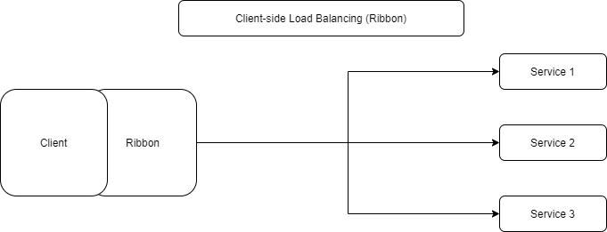

# Spring Cloud Ribbon
reference 

- https://sabarada.tistory.com/54
- https://happyer16.tistory.com/entry/%EC%8A%A4%ED%94%84%EB%A7%81-%ED%81%B4%EB%9D%BC%EC%9A%B0%EB%93%9C-%EB%A7%88%EC%9D%B4%ED%81%AC%EB%A1%9C%EC%84%9C%EB%B9%84%EC%8A%A4%EA%B0%84-%ED%86%B5%EC%8B%A0%EC%9D%B4%EB%9E%80-Ribbon

## 개요

Ribbon은 Client에 탑재하는 Load Balancer이다.

## Load Balancer

우리가 일반적으로 사용하는 LoadBalancer 는 서버사이드 로드밸런싱을 처리하는 L4 Switch와 같은 하드웨어 장비였다.  하짐나 MSA에서는 이런 장비보다는 소프트웨어적으로 구현된 클라이언트사이드 로드밸런싱을 주로 이용한다.  
    
위는 일반적인 L4 Switch 기반의 로드 밸런서이다. Client는 L4의 주소만 알고 있으면되고 모든 로드 밸런싱은 L4에서 처리해주고 있다.

이런 하드웨어 기반의 서버 사이드 로드 밸런서의 단점은 기본적으로 별도의 스위치 장비가 필요하기 때문에 상대적으로 비용이 많이 소모되게 되며 유연성도 떨어지게 된다. 또한 서버 목록의 추가는 수동으로 보통 이루어진다. 이러한 단점 때문에 클라이언트 사이드 로드밸런서가 MSA에서는 주로 사용된다. 클라이언트 사이드 로드밸런서를 사용하게되면 아래와 같이 아키텍쳐가 형성된다.
  
## Ribbon

Spring Cloud에서는 위와 같은 클라이언트 사이드 로드밸런서로 Ribbon을 이용하고 있다. 

### 구성요소

Ribbon의 구성요소로는 Rule, Ping, ServerList가 있다.

- ServerList - Load Balancing 대상 서버 목록
  - configuration을 통해 static하게 설정 가능
  - eureka 등을 기반으로 dynamic하게 설정 가능
- Rule - 요청을 보낼 서버를 선택하는 논리
  - Round Robbin - 한 서버씩 돌아가며 전달
  - Available Filtering - 에러가 많은 서버 제외
  - weighted Response Time - 서버별 응답 시간에 따라 확률 조절
- Ping - 서버 List가 살아있는지 체크하는 논리
  - static, dynamic 모두 가능

Ribbon의 가장 중요한 점은 `Retry`이다. 만약 Server에게 응답을 받지 못하였을 경우 동일한 서버로 재시도 하거나 다른 서버로 Retry하는 기능이다.
  
위의 경우 service 1에게 먼저 요청한 후 응답이 존재하지 않아 service 2로 Retry를 하여 성공응답을 받아낸 상황이다.
## Code
`application.yaml`

```properties
server:
  port: 8080

ribbon:
  eureka:
   enabled: true

# 지정된 ribbon client만 적용
ribbon-service:
   ribbon:
     MaxAutoRetries: 1
   listOfServers: localhost:8081,localhost:8082
 
# 전체 적용   
#ribbon:
#  listOfServers: localhost:8081,localhost:8082   
```
- 단일 적용 
  - Ribbon Client를 설정하고 싶을 경우 설정 가장 상단에 @RibbonClient value로 지정한 값을 설정한다.
- 전체 적용
  - 가장 상단에 ribbon 부터 시작하면 전체 설정한다.

`RibbonLoadBalancerConfiguration.java`
```java
package com.example.ribbon.config;

import com.netflix.client.config.IClientConfig;
import com.netflix.loadbalancer.AvailabilityFilteringRule;
import com.netflix.loadbalancer.IPing;
import com.netflix.loadbalancer.IRule;
import com.netflix.loadbalancer.PingUrl;
import org.springframework.beans.factory.annotation.Autowired;
import org.springframework.context.annotation.Bean;

public class RibbonLoadBalancerConfiguration {

    @Autowired
    IClientConfig ribbonClientConfig;

    @Bean
    public IPing ribbonPing(IClientConfig config) {
        return new PingUrl(false, "/ping");
    }

    @Bean
    public IRule ribbonRule(IClientConfig config) {
        return new AvailabilityFilteringRule();
    }
}
```
config java 파일에서 Ping, Rule을 구성한다.

`RestTemplateConfiguration.java`

```java
package com.example.ribbon.config;

import org.springframework.boot.web.client.RestTemplateBuilder;
import org.springframework.cloud.client.loadbalancer.LoadBalanced;
import org.springframework.cloud.netflix.ribbon.RibbonClient;
import org.springframework.cloud.netflix.ribbon.RibbonClients;
import org.springframework.context.annotation.Bean;
import org.springframework.context.annotation.Configuration;
import org.springframework.http.client.SimpleClientHttpRequestFactory;
import org.springframework.web.client.RestTemplate;

import java.time.Duration;

@RibbonClients({
        @RibbonClient(value = "ribbon-service", configuration = RibbonLoadBalancerConfiguration.class)
})
public class RestTemplateConfiguration {

    @Bean
    @LoadBalanced
    public RestTemplate restTemplate(RestTemplateBuilder builder) {
        SimpleClientHttpRequestFactory requestFactory = new SimpleClientHttpRequestFactory();
        requestFactory.setConnectTimeout(3000);
        requestFactory.setReadTimeout(10000);
        requestFactory.setBufferRequestBody(false);
        RestTemplate restTemplate = builder
                .requestFactory(() -> requestFactory)
                .setConnectTimeout(Duration.ofSeconds(3))
                .setReadTimeout(Duration.ofSeconds(10))
                .build();
        return restTemplate;
    }
}
```
주의할 점으로 @Configuration을 하지 않도록 한다. @RibbonClient 내부의 @Configuration을 사용할 수 있도록 한다.   
RestTemplate Bean 등록 메소드에 @LoadBalanced를 작성한다.

`RibbonController.java`

```java
package com.example.ribbon.controller;

import com.example.ribbon.service.RibbonService;
import org.springframework.beans.factory.annotation.Autowired;
import org.springframework.web.bind.annotation.GetMapping;
import org.springframework.web.bind.annotation.RestController;

@RestController
public class RibbonController {

    @Autowired
    private RibbonService ribbonService;

    @GetMapping(value = "/items")
    public String getItems() {
        return ribbonService.getItems();
    }
}
```

`RibbonService.java`
```java
package com.example.ribbon.service;

import com.example.ribbon.config.RestTemplateConfiguration;
import com.example.ribbon.config.RibbonLoadBalancerConfiguration;
import org.springframework.beans.factory.annotation.Autowired;
import org.springframework.cloud.client.ServiceInstance;
import org.springframework.cloud.client.loadbalancer.LoadBalancerClient;
import org.springframework.stereotype.Service;
import org.springframework.web.client.RestTemplate;
import org.springframework.web.util.UriComponentsBuilder;

@Service
public class RibbonService {

    @Autowired
    LoadBalancerClient loadBalancerClient;

    @Autowired
    private RestTemplate restTemplate;

    public String getItems() {
        /**
         * loadBalancerClient를 이용하여 직접 host, port를 가져와서 세팅할 수 있다.
         */
        final ServiceInstance choose = loadBalancerClient.choose("ribbon-service");
        System.out.println("host :: " + choose.getHost());
        System.out.println("port :: " + choose.getPort());

        /**
         * application.yaml파일에 직접 접근하여 host, port 값을 설정
         */
        String url = UriComponentsBuilder.fromHttpUrl("http://ribbon-service/items")
//                .queryParam("", "")
                .build()
                .toUriString();

        return restTemplate.getForObject(url, String.class);
    }
}
```

TODO

- 서버사이드 - Server와 Client 구조에서 Server에서 이루어지는 로직
- L4 Switch - 
- MSA - 
- Ribbon
    - eureka 