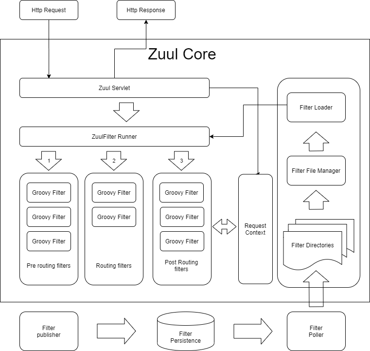

# Zuul
reference
- https://woowabros.github.io/r&d/2017/06/13/apigateway.html
## 개요
Netflix에서 사용하고 있는 API GATE WAY이다.
## 왜 Netflix에서는 Zuul을 사용하나?
Client 요청은 많은 트래픽과 다양한 형태의 요청으로 경고없이 운영에 이슈를 발생시키낟. 이러한 상황에 신속히 대응할 수 있는 시스템 zuul을 개발하였다. zuul은 이러한 문제를 신속하고, 동적으로 해결하기 위해서 groovy언어로 작성된 다양한 형태의 Filter를 실행한다. Filter에 기능을 정의하고, 이슈사항에 발생시 적절한 filter을 추가함으로써 이슈 사항을 대비한다.

## Netfilx Filter의 기능
- Authentication and Security
  - 클라이언트 요청 시, 각 리소스에 대한 인증 요구 사항을 식별하고 이를 만족시키지 않는 요청은 거부
- Insights and Monitoring
  - 의미있는 데이터 및 통계 제공
- Dynamic Routing
  - 필요에 따라 요청을 다른 클러스터로 동적으로 라우팅
- Stress Testing
  - 성능 측정을 위해 점차적으로 클러스터 트래픽을 증가
- Load Shedding
  - 각 유형의 요청에 대해 용량을 할당하고, 초과하는 요청은 제한
- Static Response handling
  - 클러스터에서 오는 응답을 대신하여 API GATE WAY에서 응답 처리
  


- Filter File Manager에서는 일정 주기 마다 정해진 directory에서 groovy로 정의된 filter 파일을 가져온다.
- javax.servle.http.HttpServlet을 상속받아서 ZuulServlet을 재정의하였고, request 요청이 들어 올때마다 아래와 같이 preRoute(), route(), postRoute()에서 ZuulFilter Runner를 실행한다.
- ZuulFilter Runner는 Filter에 정의도니 기능을 실행한다.
- 기본적으로 Filter은 다른 Filter들과 직접적으로 통신할 수 없다. 그래서 각각의 요청별로 RequestContext를 공유하여 통신할 수 있다.

```
@Override
    public void service(javax.servlet.ServletRequest servletRequest, javax.servlet.ServletResponse servletResponse) throws ServletException, IOException {
        try {
            init((HttpServletRequest) servletRequest, (HttpServletResponse) servletResponse);

            // Marks this request as having passed through the "Zuul engine", as opposed to servlets
            // explicitly bound in web.xml, for which requests will not have the same data attached
            RequestContext context = RequestContext.getCurrentContext();
            context.setZuulEngineRan();

            try {
                preRoute();
            } catch (ZuulException e) {
                error(e);
                postRoute();
                return;
            }
            try {
                route();
            } catch (ZuulException e) {
                error(e);
                postRoute();
                return;
            }
            try {
                postRoute();
            } catch (ZuulException e) {
                error(e);
                return;
            }

        } catch (Throwable e) {
            error(new ZuulException(e, 500, "UNHANDLED_EXCEPTION_" + e.getClass().getName()));
        } finally {
            RequestContext.getCurrentContext().unset();
        }
    }
```

작성중.....